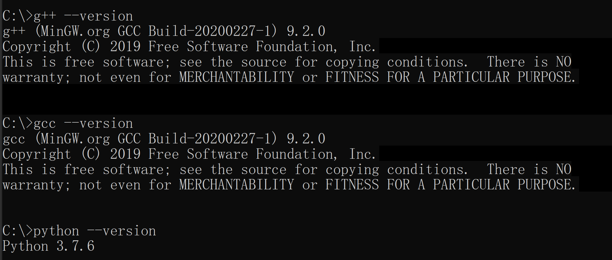
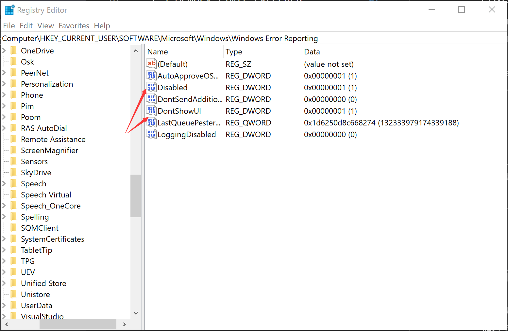
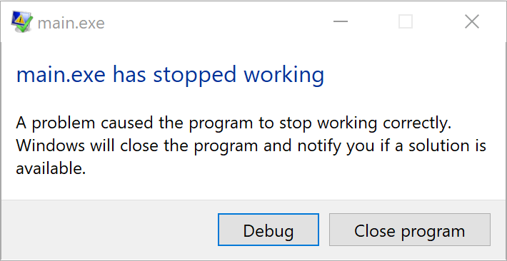

## Table of Contents
- [Background](#background)
- [Usage](#usage)
- [Unittest Usage](#unittest_usage)
- [Status](#status)
- [Configure](#configure)
- [Maintainers](#maintainers)

## Background
这一部分是SJOJ的判题Judger部分，使用Python完成的评测功能，~~因而时间和内存的检测可能不太准确~~。
## Usage
```python
from judge import Run_Code
Info = Run_Code(Student_ID, Problem_ID, Record_ID, Language, Time_Limit, Memory_Limit, Enable_HeadLine)
print(Info)

Example:
Info = Run_Code("100000", "P1000", "R10000", "gcc", 1, 128, 0)  # 最后一个是开启首行检测的开关


Info = {
    "Student_ID": Student_ID,       #  学生编号 
    "Problem_ID": Problem_ID,       #  题目编号
    "Record_ID": Record_ID,         #  提交编号
    "Time_Consume": 0,              #  时间消耗
    "Memory_Consume": 0,            #  内存消耗
    "Judge_Result": [],             #  评测结果 
}
```

目录下还有code_analyze.py是用于统计注释长度的，但是还没有想好怎么样的形式加入。

## Unittest_Usage
```python
Windows:
python test_judge.py > test_result.txt

Linux:
python3 test_judge.py > test_result.txt
# 在Record目录下已经有对于每一种错误内容的测试用例了，暂未加入没有加入首行检测的测试用例，可以自行构造
# 首行检测的测试用例就是 /* 1850000 计1班 啦啦啦 */ 或 // 1850000 计1班 啦啦啦 ，正则匹配的其实还有修改余地。
# 需要注意的是，别给Python的时间卡的太紧，可能OLE的时候会TLE.
```
## Status
现在已经能够支持Windows和Linux上的评测，评测功能已基本完成.

#### GCC / G++
- [x] Accepted
- [x] Time Limit Exceeded
- [x] Memory Limit Exceeded
- [x] Wrong Answer
- [x] Runtime Error
- [x] Output Limit Exceeded
- [x] Compile Error
- [x] Presentation Error
- [x] Illegal Code

#### Python3
- [x] Accepted
- [x] Time Limit Exceeded
- [x] Memory Limit Exceeded
- [x] Wrong Answer
- [x] Runtime Error
- [x] Output Limit Exceeded
- [x] Compile Error
- [x] Presentation Error
- [x] Illegal Code

## Configure

### 环境配置
请务必确保在环境下的有G++/GCC/Python3，例如下图所示，版本不同可能显示结果不同。


### Windows RE情况处理
在windows上程序奔溃会显示错误窗口，奔溃的进程并没有真正结束，还一直挂起在那里。根据Windows给出的[官方文档](https://docs.microsoft.com/en-us/windows/win32/wer/wer-settings?redirectedfrom=MSDN)
需要修改注册表下HKEY_LOCAL_MACHINE\SOFTWARE\Microsoft\Windows\Windows Error Reporting下的DontShowUI和Disabled将其置为1，则不会这些窗口.



错误窗口


## TODO List
- 添加编译选项配置
- 添加沙盒环境(可能就做不到跨平台了
- 多文件编译
## Maintainers
[@yyjxx2010xyu](https://github.com/yyjxx2010xyu).
